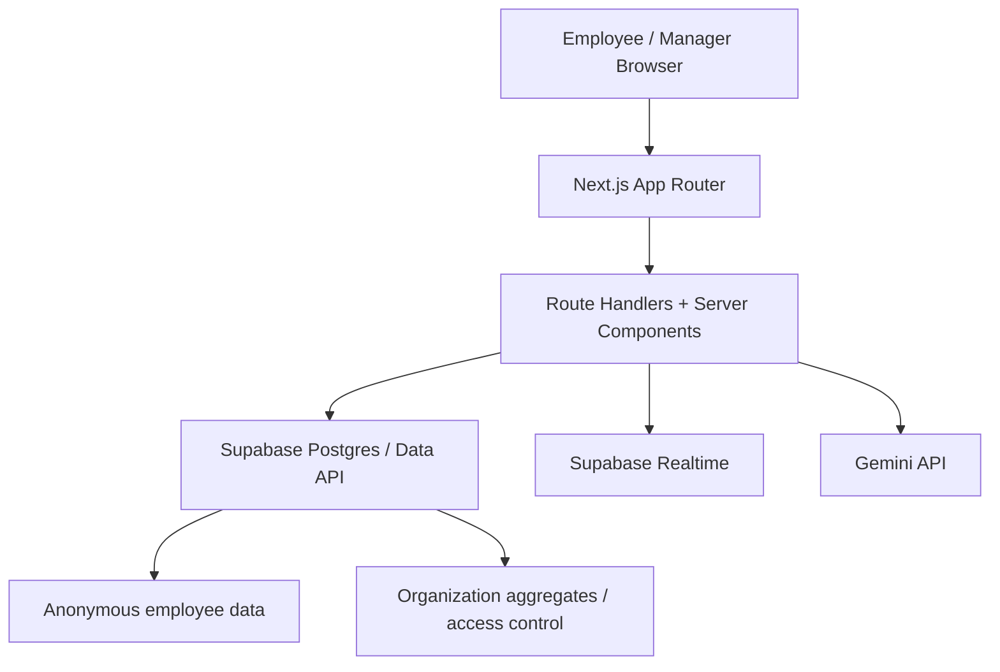

# Quietly Architecture

## Purpose

Quietly is a privacy-first workplace wellbeing product with two connected surfaces:

- an anonymous employee app for reflection, check-ins, chat, habits, and reminder notes
- an organization workspace for aggregate-only reporting, configuration, and access control

The product is intentionally designed to avoid collecting direct personal identity for employee accounts. The organization side sees anonymous aggregate signals, not individual reflections, chats, or note content.

## Core Principles

- Privacy before convenience
- Mobile-first employee experience
- Soft, supportive, non-clinical tone
- Clear separation between employee data and organization reporting
- Simple production-ready architecture with explicit security boundaries

## Technology Stack

### Frontend

- Next.js `16.2.7`
- React `19`
- TypeScript
- Tailwind CSS
- App Router with server components by default
- Small client components for forms, tabs, chat interactions, and realtime subscriptions

### Backend

- Next.js Route Handlers for HTTP APIs
- Next.js server components for authenticated page composition
- Supabase Postgres accessed through `@supabase/supabase-js`
- Supabase Realtime with short-lived custom JWTs
- Gemini API for supportive chat responses

### Security and Session Layer

- `jose` for signed JWT cookies
- `bcryptjs` for password hashing
- SHA-256 hashing for login codes and recovery codes
- CSRF token + same-origin/origin validation
- response security headers + CORS allowlist
- lightweight in-memory rate limiting

## High-Level System View

## Application Surfaces

### 1. Employee App

Primary routes:

- `/`
- `/sign-up`
- `/login`
- `/dashboard`
- `/chat`
- `/habits`

Main capabilities:

- anonymous account creation
- daily check-ins
- supportive chat
- habit tracking
- reminder notes
- landing / onboarding flow

### 2. Organization Workspace

Primary routes:

- `/business/signup`
- `/business/login`
- `/manager`
- `/manager/settings`
- `/manager/reporting`
- `/manager/access`
- `/manager/teams`

Main capabilities:

- organization account creation
- domain verification
- aggregate reporting
- role-based access control
- team grouping for anonymous members
- workspace settings and branding

## Frontend Architecture

## App Router Structure

The `app/` directory is the top-level routing layer.

- page files define route entry points
- layout files provide shared shells
- route handlers under `app/api/**` implement backend APIs

Most UI is built from small feature components under `components/`.

### UI Design System

The visual system uses:

- pale cream / green backgrounds
- teal as the primary action color
- dark charcoal text
- large rounded corners
- soft shadows
- mobile-safe spacing

The design intent is calm and premium rather than corporate or medical.

### Component Strategy

The codebase prefers:

- small presentational components
- reusable form controls
- isolated feature widgets
- business logic in `lib/**`

Notable patterns:

- `components/ui/**` for base primitives
- `components/auth/**` for shared auth flows
- `components/manager/**` for organization workspace UI
- `components/chat/**`, `components/checkins/**`, `components/habits/**`, `components/dashboard/**` for product features

## Backend Architecture

Backend behavior is split between:

- server components for secure page loading
- route handlers for mutations and API-style reads
- `lib/db/**` helpers for persistence
- `lib/auth/**` for auth orchestration
- `lib/security/**` for shared security rules

### API Layout

Important route groups:

- `app/api/auth/**`
  Employee signup, login, logout, session
- `app/api/org-auth/**`
  Organization signup, login, logout, Supabase-facing org token
- `app/api/manager/**`
  Workspace settings, domains, access, teams, reports, logo upload
- `app/api/chat`
  Chat message exchange
- `app/api/realtime/token`
  Realtime JWT minting
- `app/api/crsf`
  CSRF token bootstrap

### Data Access Layer

`lib/db/**` contains narrowly scoped persistence modules.

Examples:

- `lib/db/users.ts`
- `lib/db/chat.ts`
- `lib/db/check-ins.ts`
- `lib/db/habits.ts`
- `lib/db/reminder-notes.ts`
- `lib/db/organization-*.ts`

This keeps SQL-facing logic out of the component tree and makes auth boundaries clearer.

## Data Model

## Employee Data

Main employee-side tables:

- `app_users`
- `chat_sessions`
- `chat_messages`
- `daily_check_ins`
- `habits`
- `habit_completions`
- `reminder_notes`

Important characteristics:

- `login_code_hash` is stored, not raw login code
- `recovery_code_hash` is stored, not raw recovery code
- records are scoped by `user_id`

## Organization Data

Main organization-side tables:

- `organizations`
- `organization_users`
- `organization_domains`
- `organization_settings`
- `organization_roles`
- `organization_permissions`
- `organization_role_permissions`
- `organization_user_roles`
- `organization_teams`
- `employee_organization_links`
- `employee_organization_team_links`
- `organization_daily_aggregates`
- `organization_factor_aggregates`
- `reports`
- `report_exports`

Important characteristics:

- employee membership is organization-scoped and anonymized
- organization dashboards work from aggregate tables
- raw employee reflections are not exposed to organization views

## Authentication Architecture

### Employee Authentication

Employee auth is custom and anonymous.

Signup flow:

1. user chooses a `login_code`
2. backend normalizes it and hashes it
3. backend hashes the password with bcrypt
4. backend generates a recovery code
5. backend hashes the recovery code
6. backend inserts the user into `app_users`
7. backend issues signed access + refresh cookies

Session implementation:

- `quietly_access`
- `quietly_refresh`
- signed with `jose`
- httpOnly cookies
- short-lived access token + longer refresh token

Key files:

- `lib/auth/session.ts`
- `lib/security/jwt.ts`
- `lib/security/cookies.ts`
- `lib/auth/http.ts`

### Organization Authentication

Organization auth is separate from employee auth and uses work email + password.

Session implementation:

- `wellkey_org_access`
- `wellkey_org_refresh`
- `wellkey_org_supabase`

The extra Supabase cookie stores a short-lived organization-scoped JWT for RLS-backed Supabase access in the manager workspace.

Key files:

- `lib/auth/organization-session.ts`
- `lib/auth/organization-http.ts`
- `lib/supabase/organization-token.ts`
- `lib/supabase/organization-server.ts`

### Authorization

Employee authorization is simple:

- page or API access is based on authenticated `userId`
- every write/read is manually scoped to that user

Organization authorization is RBAC-based:

- route guards check for organization session presence
- permission checks gate workspace routes and APIs
- Supabase RLS policies also enforce org membership and permissions

Key files:

- `lib/auth/organization-guards.ts`
- `lib/organizations/permissions.ts`
- `lib/organizations/rbac.ts`
- `supabase/002_organization_policies.sql`
- `supabase/007_organization_member_access.sql`

## Security Model

### Data Minimization

Employee side deliberately avoids:

- email
- phone number
- profile names
- HR-visible individual reporting

### Password and Identifier Security

- passwords are hashed with bcrypt, 12 rounds
- login codes are normalized and hashed with SHA-256
- recovery codes are hashed with SHA-256

Key files:

- `lib/auth/password.ts`
- `lib/auth/codes.ts`

### Cookie Security

- access cookies are httpOnly
- refresh cookies are httpOnly
- secure cookies are enabled in production
- `sameSite` is set to `lax` or `strict` depending on cookie purpose

### CSRF and Origin Protection

Mutating APIs are protected by:

- CSRF cookie + `X-CSRF-Token`
- same-origin validation
- explicit origin allowlist

Key files:

- `lib/security/csrf/server.ts`
- `lib/security/csrf/client.ts`
- `lib/security/origins.ts`

### API Security Headers

Global headers include:

- `Content-Security-Policy`
- `Referrer-Policy`
- `X-Content-Type-Options`
- `X-Frame-Options`
- `Permissions-Policy`

Defined in:

- `next.config.ts`

### CORS

APIs return allowlisted CORS headers for approved origins only.

Key file:

- `lib/security/headers.ts`

### Rate Limiting

The app currently uses a lightweight in-memory limiter keyed by:

- path
- method
- user id
- IP-derived request key parts

This is simple and works for MVP / single-instance behavior, but should eventually move to a shared store for multi-instance production scaling.

Key files:

- `lib/server/ratelimits.ts`
- `lib/server/loadbalancer.ts`

### SSRF Protection

External model or fetch calls are routed through an outbound safety layer.

Key file:

- `lib/security/ssrf.ts`

## Chat Architecture

The chat system has three layers:

1. stored conversation state in Supabase
2. heuristic and safety handling in the app
3. Gemini for natural responses when heuristics do not intercept

Reply flow:

1. user message is stored
2. crisis detection runs first
3. simple heuristics handle short common cases
4. Gemini generates a reply if needed
5. fallback copy is used if Gemini is unavailable
6. reply is stored and session summary is updated

Key files:

- `lib/chat/reply.ts`
- `lib/chat/safety.ts`
- `lib/chat/summary.ts`
- `lib/db/chat.ts`

## Check-In and Habit Architecture

### Check-Ins

There are two modes:

- quick
- regular

Scoring happens server-side in `lib/db/check-ins.ts`.

Important behavior:

- reverse scoring is applied where needed
- one entry per user per day is enforced with upsert

### Habits

Habits are user-owned and lightweight.

Capabilities:

- default starter habits
- custom habit creation
- daily completion
- streak calculation
- optional reflection after completion

Key files:

- `lib/db/habits.ts`
- `lib/habits/progress.ts`
- `lib/habits/reorder.ts`
- `lib/habits/dates.ts`

## Organization Aggregate Architecture

Organization reporting is built on a separate aggregate model rather than directly querying employee reflection tables.

Important concepts:

- `employee_organization_links` maps anonymous users into organization-scoped identifiers
- `organization_daily_aggregates` stores top-level anonymous trends
- `organization_factor_aggregates` stores factor-specific anonymous signals
- teams provide optional aggregate grouping

This separation is central to the product promise:

- organizations see patterns
- employees keep individual privacy

## Realtime Architecture

Supabase Realtime is used for selected live features.

Flow:

1. browser asks `/api/realtime/token`
2. server mints a short-lived JWT
3. browser applies it to the Supabase Realtime client
4. token refreshes before expiry

Key files:

- `lib/supabase/realtime-client.ts`
- `lib/supabase/realtime-token.ts`
- `lib/supabase/browser-client.ts`

## Configuration and Environment

Main env values:

- `SESSION_SECRET`
- `SUPABASE_SERVICE_ROLE_KEY`
- `SUPABASE_JWT_SECRET`
- `GEMINI_API_KEY`
- `GEMINI_MODEL`
- `NEXT_PUBLIC_SUPABASE_URL`
- `NEXT_PUBLIC_SUPABASE_ANON_KEY`

Validation is centralized in:

- `lib/env/settings.ts`

## Deployment Model

Current deployment target:

- Vercel for web hosting

Expected runtime model:

- Next.js serverless / edge-compatible web app
- Supabase as managed database and realtime backend
- Gemini called server-side only

CI/CD:

- GitHub Actions CI validates typecheck and build
- Vercel deploy follows successful CI

## Design Approach

Employee experience goals:

- calm
- private
- emotionally safe
- useful within 60 seconds

Organization experience goals:

- aggregate visibility without surveillance
- clear governance
- simple settings and reporting controls

The design avoids:

- diagnostic language
- HR-monitoring tone
- productivity-tracker framing
- aggressive gamification

## Current Strengths

- strong privacy separation between employee and organization surfaces
- explicit auth/session code instead of hidden framework magic
- clean modular `lib/db/**` data layer
- clear security boundaries for cookies, CSRF, origins, and JWTs
- production-friendly split between manager RBAC and employee anonymity

## Known Tradeoffs

- rate limiting is in-memory, not distributed
- some manager UX flows are still MVP-level and need more polish
- organization-side report depth is intentionally lightweight today
- tests are not yet part of the codebase

## Integration Roadmap

The main remaining work areas are:

1. Vercel deployment stabilization and production verification
2. mobile polish pass across employee flows
3. manager UX refinement for reporting, access, teams, and branding
4. deeper domain verification / organization onboarding polish
5. stronger production observability and distributed runtime protections
6. automated test coverage

## File Map

High-signal directories:

- `app/`
  route entry points and APIs
- `components/`
  UI and feature components
- `lib/auth/`
  auth orchestration
- `lib/db/`
  persistence layer
- `lib/security/`
  security helpers
- `lib/supabase/`
  Supabase clients and token helpers
- `supabase/`
  schema, RLS policies, and RPC definitions
- `.github/workflows/`
  CI/CD automation
